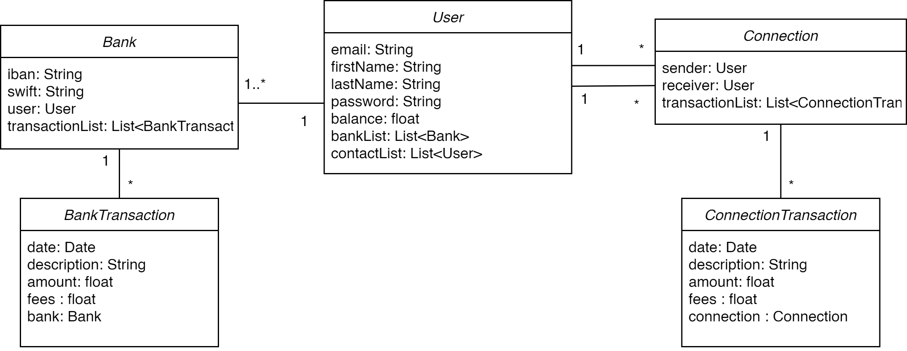
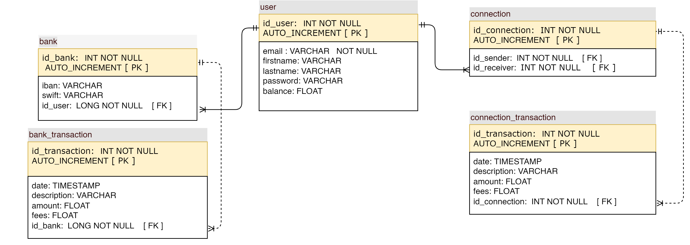

# PayMyBuddy App

PayMyBuddy, an app where you can quickly and securely transfer funds to your buddies.

### UML diagram

### MPD diagram

## Versions
- Java version: 17 
- Spring Boot version: 3.0.6 
- JDK version: 17 (recommended)

## Database

- Make sure that you have MySQL installed
- Open the config/application.properties file in your Spring Boot project.
- Complete the configuration with your own password 
- Ensure that the MySQL server is running. Connect to your MySQL server using the command-line client:
  `mysql -u your_username -p`
- Create the database by executing the following command: `CREATE DATABASE paymybuddy;`

## Run the app

To build the project, run the following command:
`mvn clean install`

To run the application, use the following command:
`mvn spring-boot:run`

The application will be accessible at `http://localhost:9000`.

You can log in with 3 users: 
- email: jane@mail.com  - password: pass
- email: john@mail.com  - password: pass
- email: jesse@mail.com  - password: pass

